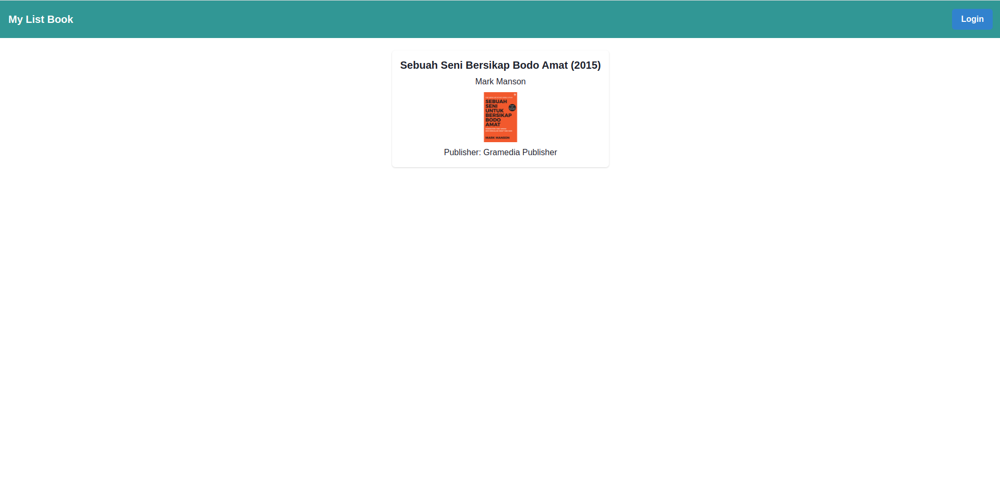
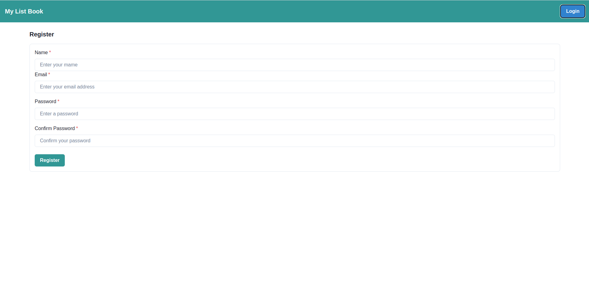
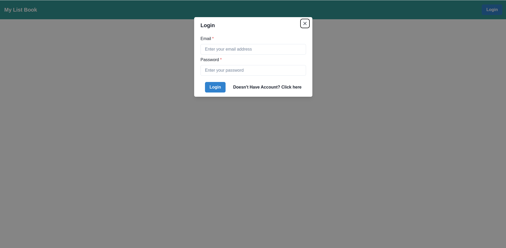
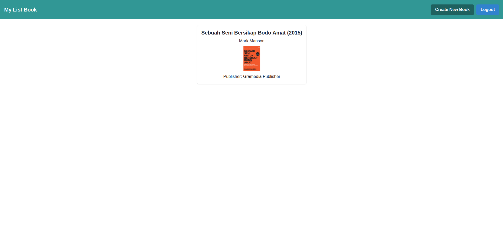
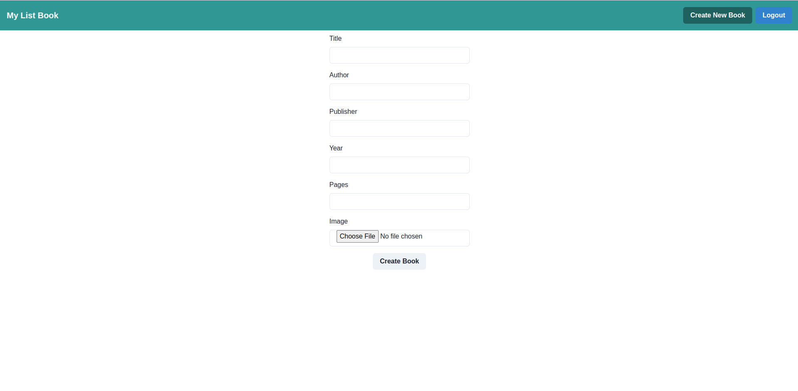
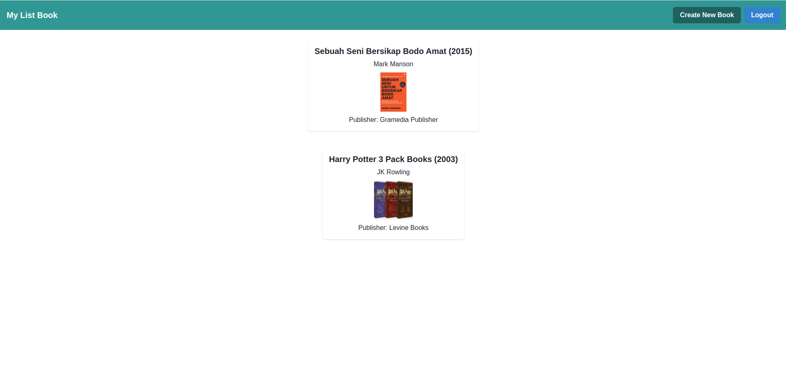

# ReactRouter-Week13 My Book List

Nama : Muhammad Raihan (FSWD 5A)

Program ini merupakan projek React Router Aplikasi Book List. Pada program ini ada beberapa endpoint utama yang digunakan untuk menjalan program yaitu sebagai berikut:

Untuk akses My Book List :
- Route My Book List : `http://localhost:5173`


## Persyaratan

Sebelum dapat menjalankan aplikasi, pastikan telah memenuhi persyaratan berikut:

- Node.js
- PostgreSQL
- Yarn
- Docker & Docker Compose (Linux) atau Docker Desktop + Compose (Windows)
- Postman (optional)

## Instalasi

1. Clone repositori ini ke komputer:

   ```bash
   git clone https://github.com/ReCodink/My-Book-List.git

2. Pindah ke direktori projek

   ```bash
   cd My-Book-List

3. Pindah ke direktori backend

    ```bash
    cd backend

4. Lalu Baca Readme.md dan jalankan perintah yang ada di ReadMe.md (direktori backend)

5. Setelah selesai, buat terminal baru kedua untuk frontend (dapat dengan klik Tombol Tambah (+) yang ada di samping kanan terminal), ketika dibuat akan mengarahkan kembali ke direktori projek
    
    ```bash
    ~My-Book-List$ ("In Linux") || MINGW64 /My-Book-List (answer) $ ("In Windows")

6. Setelah selesai, pindah ke direktori frontend

    ```bash
    cd frontend

7. Lalu Baca Readme.md dan jalankan perintah yang ada di ReadMe.md (direktori frontend)

8. Proses selesai


## Demo Program
1. Pastikan semua program sudah benar dan terhubung ke database, mulailah dengan menggunakan enpoint untuk mengakses My Book List : 

    ```bash
    http://localhost:5173

    Maka akan muncul seperti berikut:


  

2. (Optional) Jika ingin melakukan Dokumentasi API pada postman, dapat menggunakan endpoint:

     ```bash
   http://localhost:8000

  
  </br>
     
3. Untuk pertama cobalah untuk melakukan create User :

     ```bash
   http://localhost:5173/register atau melakukan dari cara ke-1

  Maka akan muncul seperti berikut :
  
  

  atau 

  </br>
  
  dari cara ke-1 :
  
  
  
  </br>
  
  kemudian klik tombol login
  
  
  
  </br>
  
  Kemudian pilih Click here, dan akan muncul seperti berikut : 
  
  
  
  </br>
  
  alert apabila berhasil, lalu login :
  
  
  
  </br>
  
  </br>
  
  kemudian beberapa demo programnya :
  
  

  kemudian buat data buku baru, kalau saya menggunakan data buku harry potter
  

  Jika sudah, maka akan muncul buku baru seperti berikut : 

  
 
  </br>
  
  selesai..